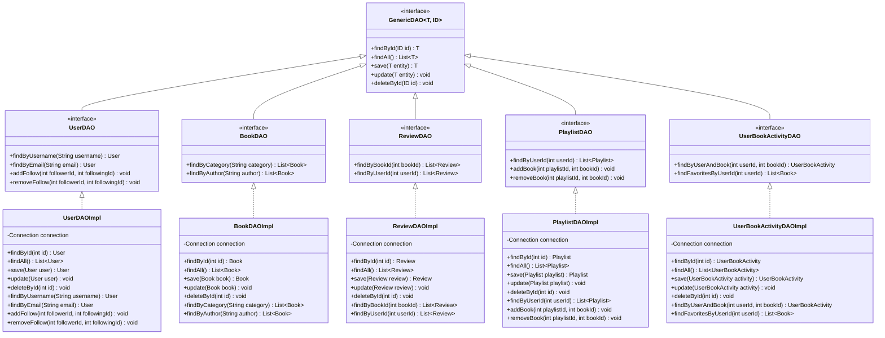

```mermaid
classDiagram
    direction TB

    class GenericDAO~T, ID~ {
        <<interface>>
        +findById(ID id) T
        +findAll() List~T~
        +save(T entity) T
        +update(T entity) void
        +deleteById(ID id) void
    }

    class UserDAO {
        <<interface>>
        +findByUsername(String username) User
        +findByEmail(String email) User
        +addFollow(int followerId, int followingId) void
        +removeFollow(int followerId, int followingId) void
    }

    class BookDAO {
        <<interface>>
        +findByCategory(String category) List~Book~
        +findByAuthor(String author) List~Book~
    }

    class ReviewDAO {
        <<interface>>
        +findByBookId(int bookId) List~Review~
        +findByUserId(int userId) List~Review~
    }

    class PlaylistDAO {
        <<interface>>
        +findByUserId(int userId) List~Playlist~
        +addBook(int playlistId, int bookId) void
        +removeBook(int playlistId, int bookId) void
    }

    class UserBookActivityDAO {
        <<interface>>
        +findByUserAndBook(int userId, int bookId) UserBookActivity
        +findFavoritesByUserId(int userId) List~Book~
    }

    GenericDAO <|-- UserDAO
    GenericDAO <|-- BookDAO
    GenericDAO <|-- ReviewDAO
    GenericDAO <|-- PlaylistDAO
    GenericDAO <|-- UserBookActivityDAO

    class UserDAOImpl {
        -Connection connection
        +findById(int id) User
        +findAll() List~User~
        +save(User user) User
        +update(User user) void
        +deleteById(int id) void
        +findByUsername(String username) User
        +findByEmail(String email) User
        +addFollow(int followerId, int followingId) void
        +removeFollow(int followerId, int followingId) void
    }

    class BookDAOImpl {
        -Connection connection
        +findById(int id) Book
        +findAll() List~Book~
        +save(Book book) Book
        +update(Book book) void
        +deleteById(int id) void
        +findByCategory(String category) List~Book~
        +findByAuthor(String author) List~Book~
    }

    class ReviewDAOImpl {
        -Connection connection
        +findById(int id) Review
        +findAll() List~Review~
        +save(Review review) Review
        +update(Review review) void
        +deleteById(int id) void
        +findByBookId(int bookId) List~Review~
        +findByUserId(int userId) List~Review~
    }

    class PlaylistDAOImpl {
        -Connection connection
        +findById(int id) Playlist
        +findAll() List~Playlist~
        +save(Playlist playlist) Playlist
        +update(Playlist playlist) void
        +deleteById(int id) void
        +findByUserId(int userId) List~Playlist~
        +addBook(int playlistId, int bookId) void
        +removeBook(int playlistId, int bookId) void
    }

    class UserBookActivityDAOImpl {
        -Connection connection
        +findById(int id) UserBookActivity
        +findAll() List~UserBookActivity~
        +save(UserBookActivity activity) UserBookActivity
        +update(UserBookActivity activity) void
        +deleteById(int id) void
        +findByUserAndBook(int userId, int bookId) UserBookActivity
        +findFavoritesByUserId(int userId) List~Book~
    }

    UserDAO <|.. UserDAOImpl
    BookDAO <|.. BookDAOImpl
    ReviewDAO <|.. ReviewDAOImpl
    PlaylistDAO <|.. PlaylistDAOImpl
    UserBookActivityDAO <|.. UserBookActivityDAOImpl
```
