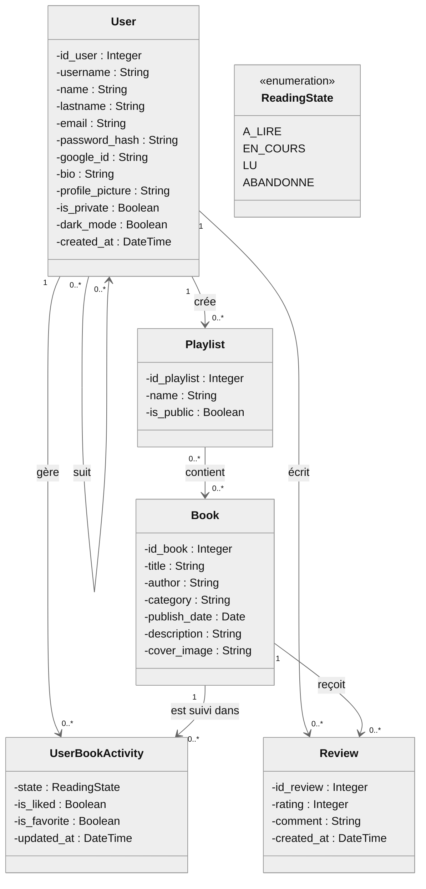

# Diagramme de Classes - Ex-Libris

```mermaid
%%{init: {'theme': 'neutral'}}%%
classDiagram
    direction TB

    class User {
        -id_user : Integer
        -username : String
        -name : String
        -lastname : String
        -email : String
        -password_hash : String
        -google_id : String
        -bio : String
        -profile_picture : String
        -is_private : Boolean
        -dark_mode : Boolean
        -created_at : DateTime
    }

    class Book {
        -id_book : Integer
        -title : String
        -author : String
        -category : String
        -publish_date : Date
        -description : String
        -cover_image : String
    }

    class ReadingState {
        <<enumeration>>
        A_LIRE
        EN_COURS
        LU
        ABANDONNE
    }

    class UserBookActivity {
        -state : ReadingState
        -is_liked : Boolean
        -is_favorite : Boolean
        -updated_at : DateTime
    }

    class Review {
        -id_review : Integer
        -rating : Integer
        -comment : String
        -created_at : DateTime
    }

    class Playlist {
        -id_playlist : Integer
        -name : String
        -is_public : Boolean
    }

    %% Relations
    User "1" --> "0..*" UserBookActivity : gère
    Book "1" --> "0..*" UserBookActivity : est suivi dans
    
    User "1" --> "0..*" Review : écrit
    Book "1" --> "0..*" Review : reçoit
    
    User "1" --> "0..*" Playlist : crée
    Playlist "0..*" --> "0..*" Book : contient
    
    User "0..*" --> "0..*" User : suit
```