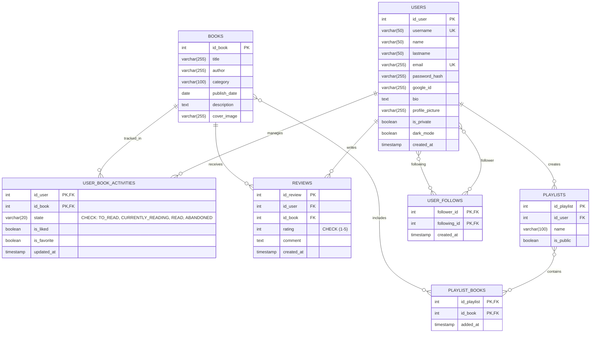

# Diagramme de Base de Données (ERD / Modèle Relationnel) - Ex-Libris

```mermaid
erDiagram
    USERS ||--o{ USER_BOOK_ACTIVITIES : "manages"
    BOOKS ||--o{ USER_BOOK_ACTIVITIES : "tracked_in"
    USERS ||--o{ REVIEWS : "writes"
    BOOKS ||--o{ REVIEWS : "receives"
    USERS ||--o{ PLAYLISTS : "creates"
    PLAYLISTS }o--o{ PLAYLIST_BOOKS : "contains"
    BOOKS }o--o{ PLAYLIST_BOOKS : "includes"
    USERS }o--o{ USER_FOLLOWS : "follower"
    USERS }o--o{ USER_FOLLOWS : "following"

    USERS {
        int id_user PK
        varchar(50) username UK
        varchar(50) name
        varchar(50) lastname
        varchar(255) email UK
        varchar(255) password_hash
        varchar(255) google_id
        text bio
        varchar(255) profile_picture
        boolean is_private
        boolean dark_mode
        timestamp created_at
    }

    BOOKS {
        int id_book PK
        varchar(255) title
        varchar(255) author
        varchar(100) category
        date publish_date
        text description
        varchar(255) cover_image
    }

    USER_BOOK_ACTIVITIES {
        int id_user PK, FK
        int id_book PK, FK
        varchar(20) state "CHECK: TO_READ, CURRENTLY_READING, READ, ABANDONED"
        boolean is_liked
        boolean is_favorite
        timestamp updated_at
    }

    REVIEWS {
        int id_review PK
        int id_user FK
        int id_book FK
        int rating "CHECK (1-5)"
        text comment
        timestamp created_at
    }

    PLAYLISTS {
        int id_playlist PK
        int id_user FK
        varchar(100) name
        boolean is_public
    }

    PLAYLIST_BOOKS {
        int id_playlist PK, FK
        int id_book PK, FK
        timestamp added_at
    }

    USER_FOLLOWS {
        int follower_id PK, FK
        int following_id PK, FK
        timestamp created_at
    }
```
