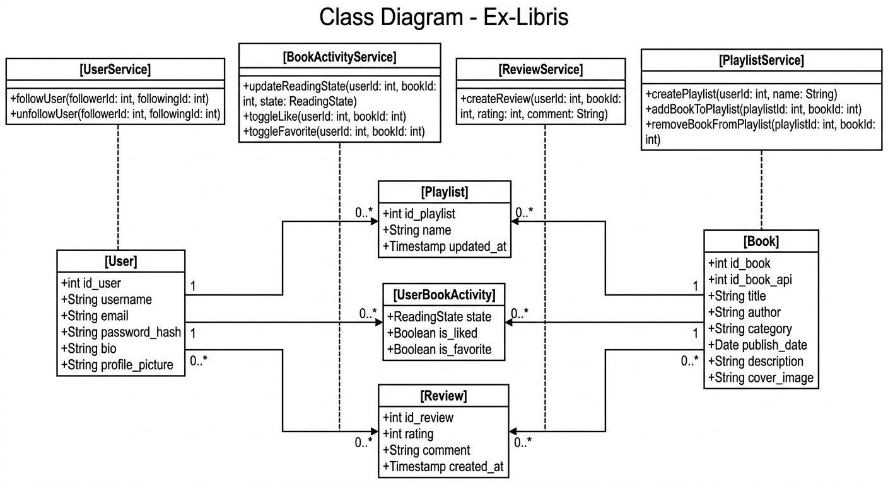
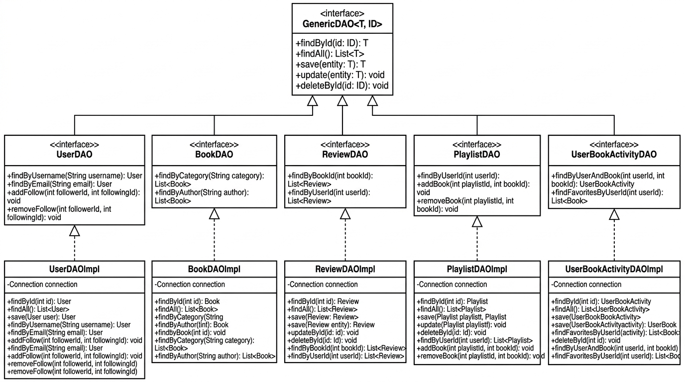
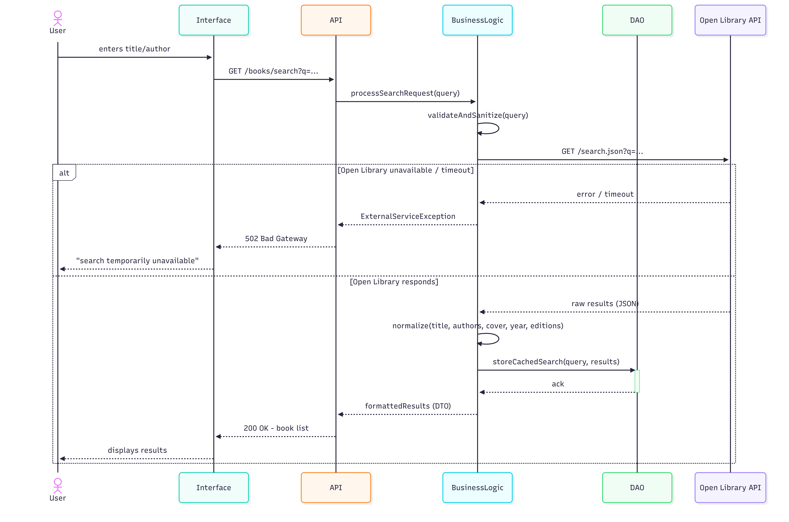
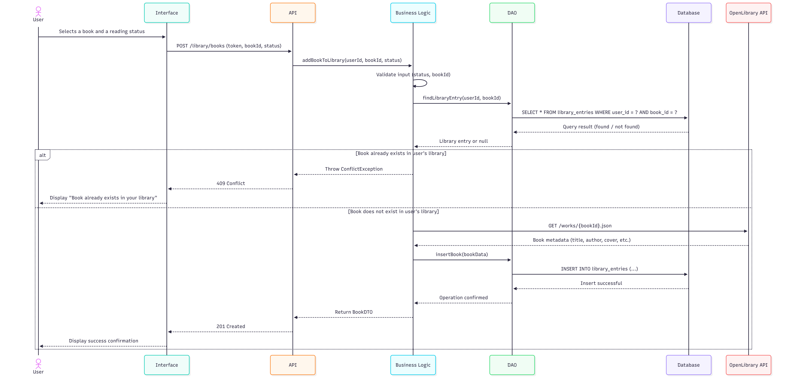
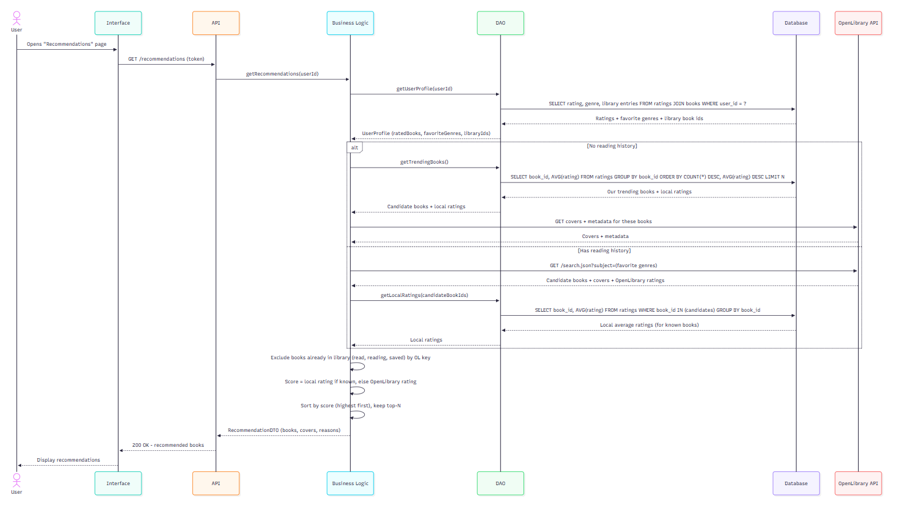

\newpage

# Description des fonctionnalités de l'application

## Présentation d’ensemble du projet

Ex-libris est une application qui s'associe en même temps à un réseau social et à une bibliothèque de gestion de livres. Elle s'adresse d'un côté à des lecteurs occasionnels, souhaitant seulement suivre l'avancement de leurs lectures et découvrir de nouveaux ouvrages. D'un autre côté, c'est une application interactive qui cible aussi les passionnés souhaitant débattre de leurs lectures, partager leurs avis, créer des playlists pour différentes thématiques et suivre les activités de leurs amis.\

Elle utilise les livres issus de l'API externe Open Library. Cette API open source nous permettra d'aller chercher toutes les données nécessaires sur les livres comme l'auteur, le nombre de pages ou encore l'illustration. En addition, notre application profitera de sa propre base de données qui servira à stocker les livres, les playlists, les avis, les mentions « j'aime » ainsi que plusieurs autres fonctionnalités.

## Utilisateur de l’application

L'accès aux fonctionnalités repose sur un unique profil d'utilisateur :

Pour accéder à Ex-Libris, il est obligatoire de créer un compte utilisateur et de se connecter pour accéder à l'application et bénéficier de ses services.
Dans une application destinée à être déployée à grande échelle, d'autres profils auraient été envisagés, notamment avec un statut d'utilisateur non connecté (pour explorer le catalogue simplement en consultation) et un statut d'administrateur (pour la modération des contenus, la gestion des signalements et l'administration des comptes). Cependant, dans le cadre de ce projet, nous avons décidé de focaliser l'architecture et la base de données sur les fonctionnalités de base de l'application et les liens entre lecteurs, sans complexifier avec la gestion d'admin.

Ainsi, chaque utilisateur disposant d'un compte possède une expérience personnalisée d'Ex-Libris.

## Fonctionnalités de base

Les fonctionnalités de base présentes dans Ex-Librus sont les suivantes:

[Gestion du compte utilisateur]{.underline} :

- Inscription
- Connexion
- Modification du profil (nom d'utilisateur, adresse email, mot de passe, biographie et photo de profil)

[Catalogue des livres]{.underline}:

- Affichage des détails d'un livre (titre, auteur, genre/catégorie, description, date de publication et illustration de couverture)
- Suivi de l'état de lecture, mise à jour du statut de lecture d'un livre (en cours, terminé, à lire, etc.)
- Marquage d'ouvrages : Gestion des mentions "j'aime" et ajout aux favoris

## Fonctionnalités avancées

Les fonctionnalités avancées de l'application sont:

[Un système d'évaluation et de critiques]{.underline} :

- Rédaction de commentaires
- Ajout d'une note chiffrée

[Playlists]{.underline} :

- Création de listes personnalisées, ajout et retrait de livres dans ces listes
- Ajout d'un nom pour la liste

[Réseau social et interactions]{.underline} :

- Système d'abonnements entre membres pour suivre d'autres utilisateurs
- , permet à chaque lecteur ai son identité en fonction de ses gouts

[Connexion avec une API]{.underline}:

- Intégration et synchronisation des données avec Open Library via un identifiant dédié

# Planning et Organisation

\begin{figure}[H]
  \centering
  \makebox[\textwidth][c]{\includegraphics[width=1.2\textwidth]{img/gantt.png}}
  \caption{Diagramme de GANTT}
\end{figure}

Le déroulement du projet s'organise selon un découpage temporel structuré en trois grandes phases, formalisé dans le diagramme de Gantt ci-dessus :

[Phase 1 — Analyse et modélisation]{.underline} (du 28/08/26 au 17/09/26) : 

Cette première étape est consacrée à la spécification des besoins, à la conception des diagrammes UML ainsi qu'à la rédaction du dossier d'analyse. Concrètement elle permet de structurer temporellement et techniquement l'ensemble du projet. Cette phase s'achève avec la livraison de cette première version intermédiaire (V0).

[Phase 2 — Développement]{.underline} (du 18/09/26 au 21/11/26) : 

Cette phase concentre la réalisation technique de l'application, allant de la création des objets métier au développement des différentes couches d'architecture et à la mise en place des tests unitaires. Les tâches représentées en violet clair (résolution de bugs avancée, optimisation globale et interface frontend) constituent des éléments supplémentaires venant enrichir le socle fonctionnel principal.

[Phase 3 — Fin de projet]{.underline} (du 18/09/26 au 09/12/26) : 

Menée en partie en parallèle de la phase de développement pour la rédaction du rapport, elle regroupe la finalisation du rapport complet, de la restitution du code source jusqu'à la préparation à la soutenance orale.
Les blocs identifiés par la couleur rouge correspondent aux échéances majeures du calendrier (rendus de rapports, livraison du code et soutenance finale), ce sont les moments clés où l'état d'avancement du projet est transmis à l'équipe encadrante. Les repères en vert indiquent quant à eux les réunions de suivi planifiées avec le tuteur.

# Modélisation UML

## Diagramme des cas d'utilisation

\begin{figure}[H]
  \centering
  \makebox[\textwidth][c]{\includegraphics[width=1\textwidth]{img/cas_dutilisation.png}}
  \caption{Diagramme des cas d'utilisation}
\end{figure}

Deux niveaux d'usage sont accessibles au sein d'Ex-Libris, une fois l'utilisateur connecté à son compte. En effet, contrairement à d'autres projets où l'application reste consultable sans identification, notre sujet impose qu'aucune fonctionnalité ne soit accessible de manière anonyme : la création d'un compte est donc un prérequis à toute interaction avec l'application, y compris pour une simple recherche.

Le premier niveau regroupe les fonctionnalités de base liées à la recherche et à la découverte de livres. L'utilisateur peut ainsi rechercher un ouvrage, consulter sa fiche détaillée (couverture, auteur, année de parution, nombre de pages...), lire les avis et les notes déjà déposés par les autres utilisateurs, ainsi qu'accéder à des recommandations qu'il pourra filtrer par genre ou par note moyenne.

Le second niveau vient enrichir cette expérience de base à mesure que l'utilisateur constitue sa propre bibliothèque. Il pourra alors rédiger ses propres avis sur les livres lus, créer des playlists organisées par thème, et suivre ses statistiques de lecture (répartition par genre, nombre de pages lues, etc.). Nous avons également souhaité donner une dimension ludique au suivi de lecture, à travers un système de quêtes et de succès qui doit inciter l'utilisateur à lire davantage, un peu à la manière d'un jeu. Enfin, l'utilisateur peut suivre d'autres lecteurs afin de consulter leurs statistiques et de recevoir des suggestions de livres basées sur leurs propres lectures

## Diagramme de classes

Le diagramme de classes de notre projet illustre une architecture orientée vers les services. Il est caractérisée par une séparation entre les objets de données et la logique métier. Ce découpage en plusieurs modules a été choisie pour garantir la maintenabilité du code et faciliter l'évolution de notre application. Au cœur de ce système, l'entité Book est conçue pour interagir avec l'API Open Library. Afin d'assurer des temps de réponse rapides et de ne pas dépendre exclusivement de requêtes externes à chaque affichage, nous avons pris le parti de stocker localement les informations essentielles de l'œuvre, telles que le titre, l'auteur, la description et la couverture. Le choix architectural majeur réside dans l'attribut id_book_api, qui agit comme une référence unique permettant de synchroniser et d'enrichir nos données locales à la demande via l'API externe. En même temps, User centralise les informations de profil et assure la sécurité des accès grâce au hachage du mot de passe.

Pour offrir la meilleure expérience possible de notre application, nous avons fragmenté les interactions entre les utilisateurs et les œuvres à travers trois modèles relationnels distincts. L'entité UserBookActivity sert de table d'association liant directement un utilisateur à un livre pour suivre son état de lecture, ses mentions "j'aime" et ses favoris. En isolant cette activité, nous allons pouvoir enregistrer des interactions rapides sans obliger l'utilisateur à formuler un avis détaillé. Lorsqu'une évaluation plus poussée est souhaitée, l'entité Review prend le relais. Elle est indépendante de l'activité de base et elle permet d'associer une note sur 5 et un commentaire à une œuvre. L'heure et la date de la note et du commentaire sont aussi enregistré. Enfin, l'entité Playlist apporte une dimension de curation au projet. Elle offre aux membres la possibilité de regrouper et d'organiser les livres selon leurs propres critères de pertinence.

Afin de respecter le principe de responsabilité unique, l'ensemble de la logique de l'application et des actions est encapsulé au sein d'une couche de services dédiée. Les classes comme BookActivityService, ReviewService ou PlaylistService concentrent les méthodes d'interaction complexes, évitant ainsi de surcharger les modèles de données avec des traitements lourds. De plus, l'intégration des méthodes permettant de s'abonner à d'autres membres (comme followUser et unfollowUser) au sein du UserService prépare techniquement le terrain pour les fonctionnalités sociales de l'application. Cette séparation assure que les entités de données restent légères et strictement centrées sur leur structure, tandis que les services orchestrent les flux d'informations.

## Diagramme de classes DAO

Dans le cadre de l'architecture logicielle de notre application, nous avons fait le choix méthodologique d'isoler la couche d'accès aux données dans un diagramme de classes dédié, distinct du diagramme de domaine principal. Le diagramme de classes métier a pour vocation exclusive de représenter les entités du domaine, leurs attributs intrinsèques ainsi que la logique applicative orchestrée par les services. Si nous avions fusionné l'ensemble des interfaces et des classes d'accès aux données au sein de ce même schéma, nous aurions surchargé visuellement la modélisation en mêlant des responsabilités conceptuelles très différentes. Cette séparation explicite respecte le principe de responsabilité unique ainsi que les bonnes pratiques de découplage en couches, en délimitant rigoureusement ce qui relève du traitement métier d'un côté et ce qui dépend des contraintes d'infrastructure et de persistance SQL de l'autre.

L'organisation de ce diagramme repose sur le patron de conception Data Access Object, structuré selon une hiérarchie en trois niveaux complémentaires. Au sommet de cette architecture se trouve l'interface générique `GenericDAO<T, ID>`, qui capture et factorise l'ensemble des opérations de persistance élémentaires communes à toutes les tables, à savoir la création, la lecture par identifiant, la mise à jour, la suppression et la récupération exhaustive. L'usage des types paramétrés permet d'éviter toute redondance de signatures de code pour les requêtes basiques, garantissant ainsi le respect strict du principe de non-répétition.

Au niveau intermédiaire, nous retrouvons les interfaces spécialisées propres à chaque entité du système, telles que `UserDAO`, `BookDAO`, `ReviewDAO`, `PlaylistDAO` et `UserBookActivityDAO`. Ces entités héritent directement de `GenericDAO` par une relation d'héritage d'interface en UML, symbolisée par des traits pleins terminés par un triangle vide. Cette relation signifie que chaque sous-interface hérite automatiquement de toutes les méthodes fondamentales sans avoir à les redéclarer, tout en enrichissant le contrat avec des opérations spécifiques indispensables aux besoins métier, comme la recherche d'un utilisateur par son adresse électronique ou le filtrage des ouvrages par catégorie. La couche de service n'interagit qu'avec ces interfaces abstraites, ce qui garantit une indépendance totale vis-à-vis des détails techniques de stockage.

Enfin, le niveau inférieur rassemble les classes d'implémentation concrètes suffixées par `Impl`, connectées aux interfaces par une relation de réalisation en UML, représentée par des flèches en pointillés munies du même triangle vide. Ce sont exclusivement ces classes qui portent la responsabilité technique de la persistance, intégrant la gestion des connexions de base de données, l'exécution des requêtes SQL et la conversion des résultats relationnels en objets exploitables par l'application. En orientant les dépendances de haut niveau vers des abstractions plutôt que vers des implémentations concrètes, cette conception applique scrupuleusement le principe d'inversion des dépendances, assurant ainsi une maintenabilité accrue et permettant de changer de moteur de persistance à l'avenir sans impacter la logique applicative existante.

## Diagramme de Base de Données

Le schéma de la base de données s'articule autour de deux entités fondamentales : les membres et les œuvres littéraires. La table `USERS` est conçue pour garantir l'intégrité des données d'identification, notamment par l'application de contraintes d'unicité sur le pseudonyme et l'adresse électronique, tout en prévoyant le stockage du mot de passe haché et des éléments de profil. En parallèle, la table `BOOKS` agit comme le référentiel central des œuvres, répertoriant les métadonnées indispensables à l'application telles que le titre, l'auteur, la catégorie et la date de publication.

Pour traduire la richesse des interactions possibles entre les lecteurs et les œuvres, l'architecture s'appuie sur des tables de liaison spécifiques. La table `USER_BOOK_ACTIVITIES` utilise une clé primaire composite, associant directement l'identifiant de l'utilisateur à celui du livre, pour éviter toute duplication d'état. Elle intègre une contrainte de validation stricte sur l'état de lecture limitant les valeurs à quatre statuts précis, tout en gérant les mentions favorites et les appréciations. Totalement indépendante de ce suivi d'état, la table `REVIEWS` offre aux membres la possibilité de rédiger des critiques détaillées et horodatées. Cette table possède sa propre clé primaire et applique une contrainte de validation sur la note, restreignant obligatoirement celle-ci à un entier compris entre un et cinq.

Enfin, le modèle de données soutient activement les fonctionnalités de curation et l'aspect communautaire de la plateforme. Le système de listes de lecture personnalisées est structuré autour de la table `PLAYLISTS`, liée à son créateur, et de la table d'association `PLAYLIST_BOOKS`. Cette dernière emploie une clé primaire composite pour associer une multitude de livres à une même liste de manière claire et sans redondance. La dimension sociale est quant à elle assurée par la table `USER_FOLLOWS`. Il s'agit d'une table de liaison réflexive qui pointe vers l'entité des utilisateurs, ce qui permet de modéliser avec précision le système d'abonnement en distinguant clairement l'abonné de la personne suivie par le biais de deux clés étrangères distinctes.

## Diagrammes de séquence

Ce premier diagramme illustre le cheminement d'une recherche de livre, depuis la saisie du titre ou de l'auteur jusqu'à l'affichage des résultats. La requête transite par l'API (`GET /books/search`), qui délègue à la couche métier la validation et l'assainissement de la saisie avant d'interroger Open Library. Nous avons porté une attention particulière à la gestion de la disponibilité de cette API externe : en cas d'indisponibilité ou de délai dépassé, une exception dédiée (`ExternalServiceException`) est levée et l'utilisateur reçoit un message explicite plutôt qu'une erreur brute. Lorsque la requête aboutit, les résultats sont normalisés puis mis en cache par la DAO avant d'être renvoyés à l'utilisateur, ce qui doit permettre à terme de limiter les appels répétés à Open Library pour des recherches identiques ou fréquentes.

Ce second diagramme détaille le processus d'ajout d'un livre à la bibliothèque de l'utilisateur, avec le statut de lecture associé. La couche métier commence par vérifier, via la DAO, si ce livre figure déjà dans la bibliothèque de l'utilisateur concerné : le cas échéant, une erreur 409 est renvoyée pour éviter tout doublon. Dans le cas contraire, l'application va chercher les métadonnées du livre directement auprès d'Open Library (`GET /works/{bookId}.json`) afin de les stocker localement, avant de créer l'entrée correspondante en base et de confirmer l'opération par une réponse 201. Ce fonctionnement traduit concrètement le choix d'architecture décrit dans le diagramme de classes : les données d'un livre ne sont rapatriées et persistées localement qu'au moment où un utilisateur interagit réellement avec cette œuvre, plutôt que d'être importées en masse depuis l'API.

Ce dernier diagramme correspond à la fonctionnalité de recommandation, que nous avons choisie comme fonctionnalité avancée du projet. Après récupération du profil de l'utilisateur (notes attribuées, genres favoris, contenu de sa bibliothèque), deux scénarios sont distingués. Si l'utilisateur ne dispose d'aucun historique de lecture, l'application lui propose les livres les mieux notés et les plus commentés parmi l'ensemble des utilisateurs. S'il possède déjà un historique, la recherche est affinée en interrogeant Open Library sur ses genres favoris, puis en croisant ces résultats avec les notes locales déjà disponibles pour ces ouvrages. Dans les deux cas, les livres déjà présents dans la bibliothèque de l'utilisateur sont exclus des suggestions, un score est calculé en priorisant la note locale lorsqu'elle existe, et seuls les meilleurs résultats sont conservés avant d'être retournés à l'utilisateur.
