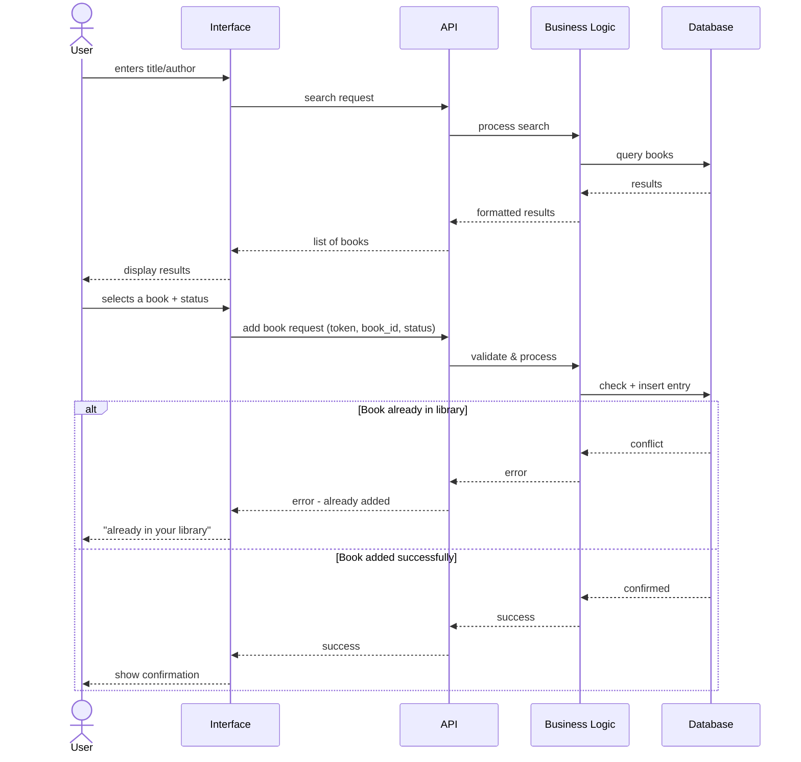

# Ex-Libris — Sequence Diagram (F2: Search + F3: Add to Library)

```mermaid
sequenceDiagram
    actor User
    participant Interface
    participant API
    participant Metier as Business Logic
    participant DB as Database

    %% ===== F2: Book search =====
    User->>Interface: enters title/author
    Interface->>API: search request
    API->>Metier: process search
    Metier->>DB: query books
    DB-->>Metier: results
    Metier-->>API: formatted results
    API-->>Interface: list of books
    Interface-->>User: display results

    %% ===== F3: Add a book to the library =====
    User->>Interface: selects a book + status
    Interface->>API: add book request (token, book_id, status)
    API->>Metier: validate & process
    Metier->>DB: check + insert entry

    alt Book already in library
        DB-->>Metier: conflict
        Metier-->>API: error
        API-->>Interface: error - already added
        Interface-->>User: "already in your library"
    else Book added successfully
        DB-->>Metier: confirmed
        Metier-->>API: success
        API-->>Interface: success
        Interface-->>User: show confirmation
    end
```
