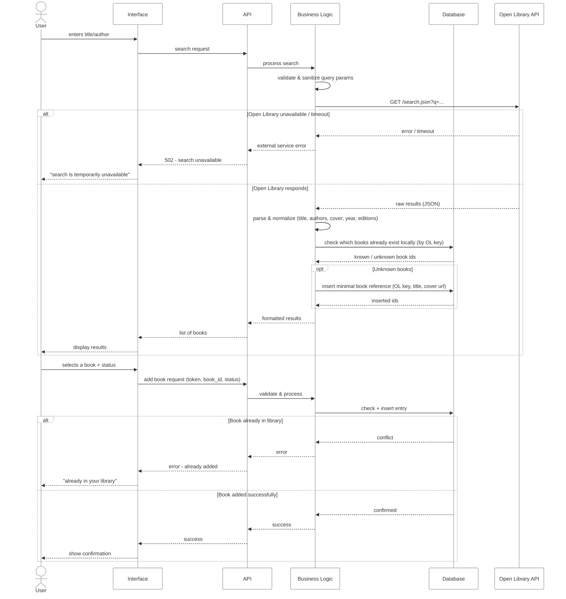

```mermaid
---
config:
  theme: neo
  look: classic
---
sequenceDiagram
    actor User
    participant Interface
    participant API
    participant Metier as Business Logic
    participant DB as Database
    participant OL as Open Library API

    %% ===== F2: Book search =====
    User->>Interface: enters title/author
    Interface->>API: search request
    API->>Metier: process search

    Metier->>Metier: validate & sanitize query params
    Metier->>OL: GET /search.json?q=...
    alt Open Library unavailable / timeout
        OL-->>Metier: error / timeout
        Metier-->>API: external service error
        API-->>Interface: 502 - search unavailable
        Interface-->>User: "search is temporarily unavailable"
    else Open Library responds
        OL-->>Metier: raw results (JSON)
        Metier->>Metier: parse & normalize (title, authors, cover, year, editions)
        Metier->>DB: check which books already exist locally (by OL key)
        DB-->>Metier: known / unknown book ids
        opt Unknown books
            Metier->>DB: insert minimal book reference (OL key, title, cover url)
            DB-->>Metier: inserted ids
        end
        Metier-->>API: formatted results
        API-->>Interface: list of books
        Interface-->>User: display results
    end

    %% ===== F3: Add a book to the library =====
    User->>Interface: selects a book + status
    Interface->>API: add book request (token, book_id, status)
    API->>Metier: validate & process
    Metier->>DB: check + insert entry

    alt Book already in library
        DB-->>Metier: conflict
        Metier-->>API: error
        API-->>Interface: error - already added
        Interface-->>User: "already in your library"
    else Book added successfully
        DB-->>Metier: confirmed
        Metier-->>API: success
        API-->>Interface: success
        Interface-->>User: show confirmation
    end
```
