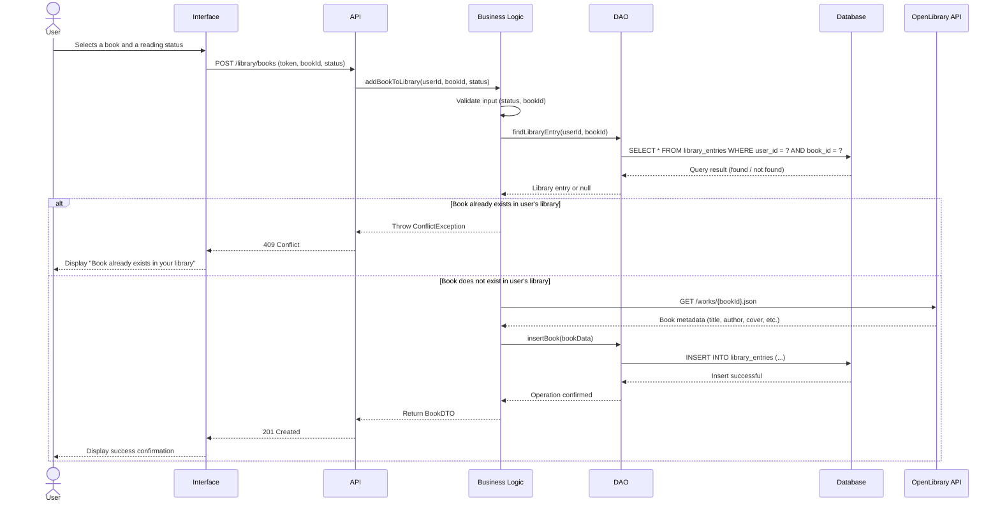

```mermaid
sequenceDiagram
    actor User

    participant Interface
    participant API
    participant BL as Business Logic
    participant DAO
    participant DB as Database
    participant OL as OpenLibrary API

    User->>Interface: Selects a book and a reading status
    Interface->>API: POST /library/books (token, bookId, status)
    API->>BL: addBookToLibrary(userId, bookId, status)

    BL->>BL: Validate input (status, bookId)
    BL->>DAO: findLibraryEntry(userId, bookId)
    DAO->>DB: SELECT * FROM library_entries WHERE user_id = ? AND book_id = ?
    DB-->>DAO: Query result (found / not found)
    DAO-->>BL: Library entry or null

    alt Book already exists in user's library
        BL-->>API: Throw ConflictException
        API-->>Interface: 409 Conflict
        Interface-->>User: Display "Book already exists in your library"

    else Book does not exist in user's library
        BL->>OL: GET /works/{bookId}.json
        OL-->>BL: Book metadata (title, author, cover, etc.)

        BL->>DAO: insertBook(bookData)
        DAO->>DB: INSERT INTO library_entries (...)
        DB-->>DAO: Insert successful
        DAO-->>BL: Operation confirmed

        BL-->>API: Return BookDTO
        API-->>Interface: 201 Created
        Interface-->>User: Display success confirmation
    end
```
