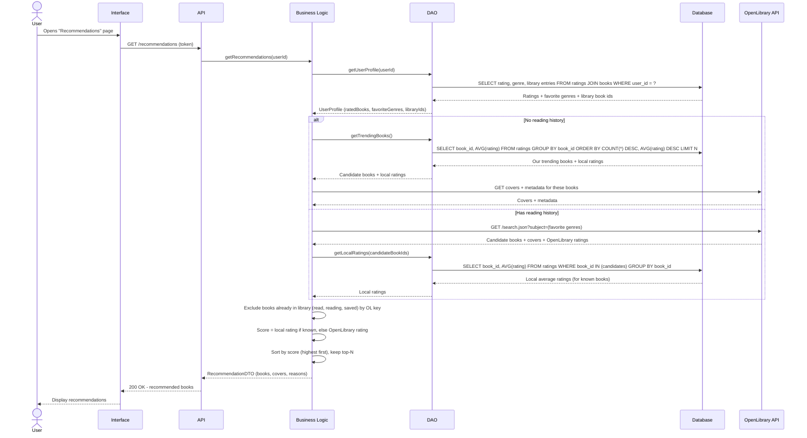

```mermaid
sequenceDiagram
    actor User

    participant Interface
    participant API
    participant BL as Business Logic
    participant DAO
    participant DB as Database
    participant OL as OpenLibrary API

    User->>Interface: Opens "Recommendations" page
    Interface->>API: GET /recommendations (token)
    API->>BL: getRecommendations(userId)

    BL->>DAO: getUserProfile(userId)
    DAO->>DB: SELECT rating, genre, library entries FROM ratings JOIN books WHERE user_id = ?
    DB-->>DAO: Ratings + favorite genres + library book ids
    DAO-->>BL: UserProfile (ratedBooks, favoriteGenres, libraryIds)

    alt No reading history
        BL->>DAO: getTrendingBooks()
        DAO->>DB: SELECT book_id, AVG(rating) FROM ratings GROUP BY book_id ORDER BY COUNT(*) DESC, AVG(rating) DESC LIMIT N
        DB-->>DAO: Our trending books + local ratings
        DAO-->>BL: Candidate books + local ratings
        BL->>OL: GET covers + metadata for these books
        OL-->>BL: Covers + metadata

    else Has reading history
        BL->>OL: GET /search.json?subject=(favorite genres)
        OL-->>BL: Candidate books + covers + OpenLibrary ratings
        BL->>DAO: getLocalRatings(candidateBookIds)
        DAO->>DB: SELECT book_id, AVG(rating) FROM ratings WHERE book_id IN (candidates) GROUP BY book_id
        DB-->>DAO: Local average ratings (for known books)
        DAO-->>BL: Local ratings
    end

    BL->>BL: Exclude books already in library (read, reading, saved) by OL key
    BL->>BL: Score = local rating if known, else OpenLibrary rating
    BL->>BL: Sort by score (highest first), keep top-N

    BL-->>API: RecommendationDTO (books, covers, reasons)
    API-->>Interface: 200 OK - recommended books
    Interface-->>User: Display recommendations
```
