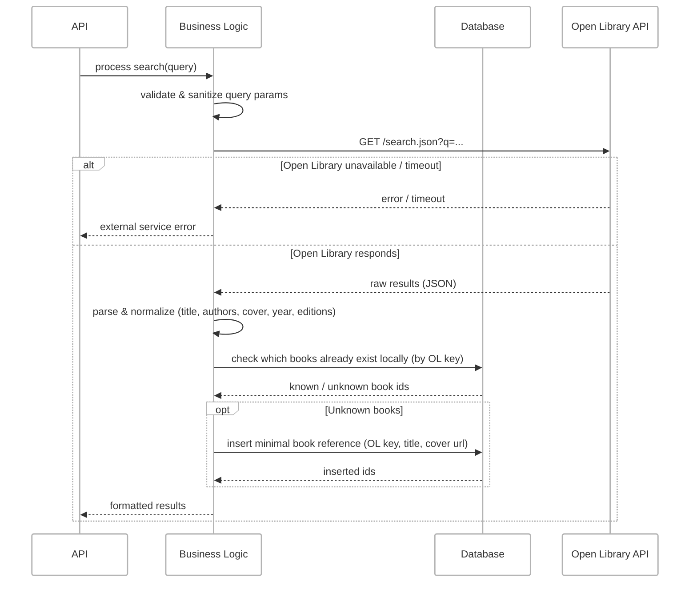

```mermaid
---
config:
  theme: neo
  look: classic
---
sequenceDiagram
    participant API
    participant Metier as Business Logic
    participant DB as Database
    participant OL as Open Library API

    %% ===== Zoom on "process search" (F2) =====
    API->>Metier: process search(query)

    Metier->>Metier: validate & sanitize query params

    Metier->>OL: GET /search.json?q=...
    alt Open Library unavailable / timeout
        OL-->>Metier: error / timeout
        Metier-->>API: external service error
    else Open Library responds
        OL-->>Metier: raw results (JSON)
        Metier->>Metier: parse & normalize (title, authors, cover, year, editions)
        Metier->>DB: check which books already exist locally (by OL key)
        DB-->>Metier: known / unknown book ids
        opt Unknown books
            Metier->>DB: insert minimal book reference (OL key, title, cover url)
            DB-->>Metier: inserted ids
        end
        Metier-->>API: formatted results
    end
```
