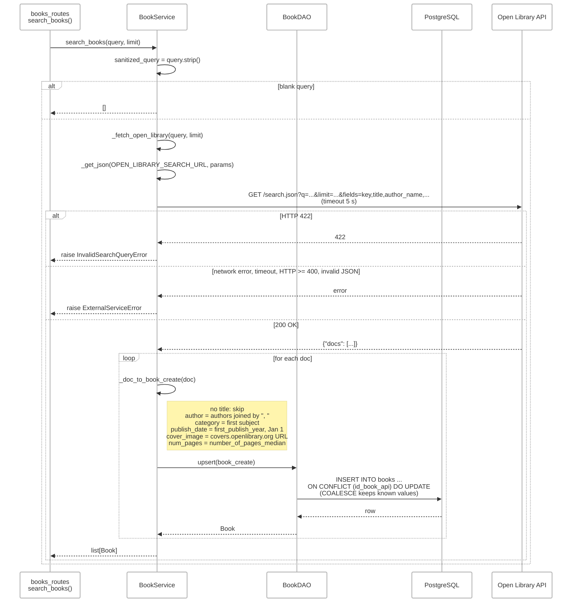

# Ex-Libris — Zoom on `BookService.search_books` (F2)

Inside the business layer of the search: how one Open Library request becomes a list of books stored locally.

```mermaid
---
config:
  theme: neo
  look: classic
---
sequenceDiagram
    participant API as books_routes<br/>search_books()
    participant BS as BookService
    participant DAO as BookDAO
    participant DB as PostgreSQL
    participant OL as Open Library API

    API->>BS: search_books(query, limit)
    BS->>BS: sanitized_query = query.strip()
    alt blank query
        BS-->>API: []
    else
        BS->>BS: _fetch_open_library(query, limit)
        BS->>BS: _get_json(OPEN_LIBRARY_SEARCH_URL, params)
        BS->>OL: GET /search.json?q=...&limit=...&fields=key,title,author_name,...<br/>(timeout 5 s)

        alt HTTP 422
            OL-->>BS: 422
            BS-->>API: raise InvalidSearchQueryError
        else network error, timeout, HTTP >= 400, invalid JSON
            OL-->>BS: error
            BS-->>API: raise ExternalServiceError
        else 200 OK
            OL-->>BS: {"docs": [...]}
            loop for each doc
                BS->>BS: _doc_to_book_create(doc)
                Note right of BS: no title: skip<br/>author = authors joined by ", "<br/>category = first subject<br/>publish_date = first_publish_year, Jan 1<br/>cover_image = covers.openlibrary.org URL<br/>num_pages = number_of_pages_median
                BS->>DAO: upsert(book_create)
                DAO->>DB: INSERT INTO books ...<br/>ON CONFLICT (id_book_api) DO UPDATE<br/>(COALESCE keeps known values)
                DB-->>DAO: row
                DAO-->>BS: Book
            end
            BS-->>API: list[Book]
        end
    end
```
